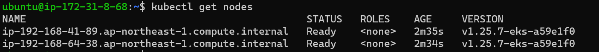

QUESTION:
---------
* Use case: Need to create a 3-tier web application using Docker + Kubernetes utilizing any of their favorite Infrastructure as Code. It can be a dummy application or hello world too. But should be able to demonstrate the understanding of the technologies.
ANSWER:
-------
* Basic 3 tier of an application consists of 3 layers 
* 1. The presentation layer
* 2. application layer
* 3. database layer
  
* The architecture of the deployment is
  
* 1. presentation layer of the application represents the UI, and provides the user interface for interaction and the display of information. This layer could be a web application, mobile application, or a third-party application consuming your services.
* 2. An application layer is an abstraction layer that specifies the shared communications protocols and interface methods used by hosts in a communications network. An application layer abstraction is specified in both the Internet Protocol Suite (TCP/IP) and the OSI model.
* 3. Database layer consists of a database which is attched to application for data storage.

* For the purpose iam taking the Python flask application whichh consists of an application and mysql database. [referhere](https://github.com/Kiranteja623/StudentCoursesRestAPI.git)
* I have already build the docker image and pushed it into the docker repository [referhere](https://hub.docker.com/repository/docker/kiranteja623/studentcourseapi/general).
* For the deployment of this application i am using the EKS k8s cluster. The eks cluster is created through eksctl. 
* Then i have created two types of pods 
*  a. One is the pod which  contains the application.
*  b. Second one is the pod which contains the mysql pod.
*  For this application i have taken the aws infrastucture through Terraform.
*  The instance for building docker image was built through terraform.
*   For creating cluster through eksctl we have following steps
*   1. Create a linux instance, install aws cli, create iam credentials
*   2. install kubectl [Referhere](https://kubernetes.io/docs/tasks/tools/install-kubectl-linux/#install-using-other-package-management)
*   3. Install eksctl [referhere](https://eksctl.io/introduction/#for-unix)
*   4. Create a file called as cluster.yaml with the following content
```
apiVersion: eksctl.io/v1alpha5
kind: ClusterConfig

metadata:
  name: basic-cluster
  region: us-west-2

nodeGroups:
  - name: basic
    instanceType: t2.large
    desiredCapacity: 2
    volumeSize: 20
    ssh:
      allow: true # will use ~/.ssh/id_rsa.pub as the default ssh key

```
* 5. Execute ssh-keygen ssh-keygen
* 6. add the key to  aws
* 7. Now execute the command eksctl create cluster -f cluster.yaml
  
  
* Now apply the manifests.
* then run 'kubectl get deplloyments'
  
* to know about pods apply 'kubectl get pods'
  
* To get the services, run 'kubectl get svc'
  
* The website interface
  
* In this we are using two pods one is for app and another is for db(mysql).